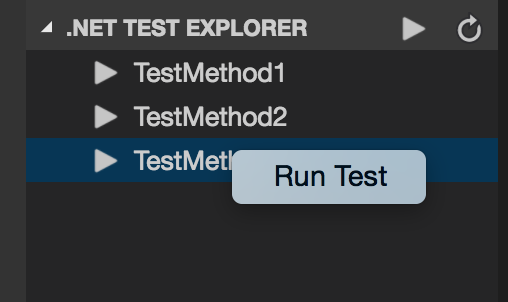
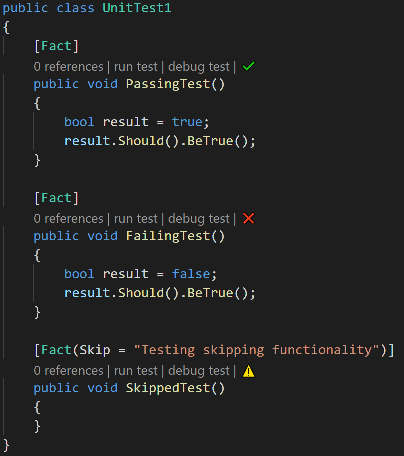
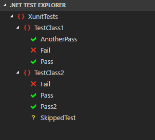
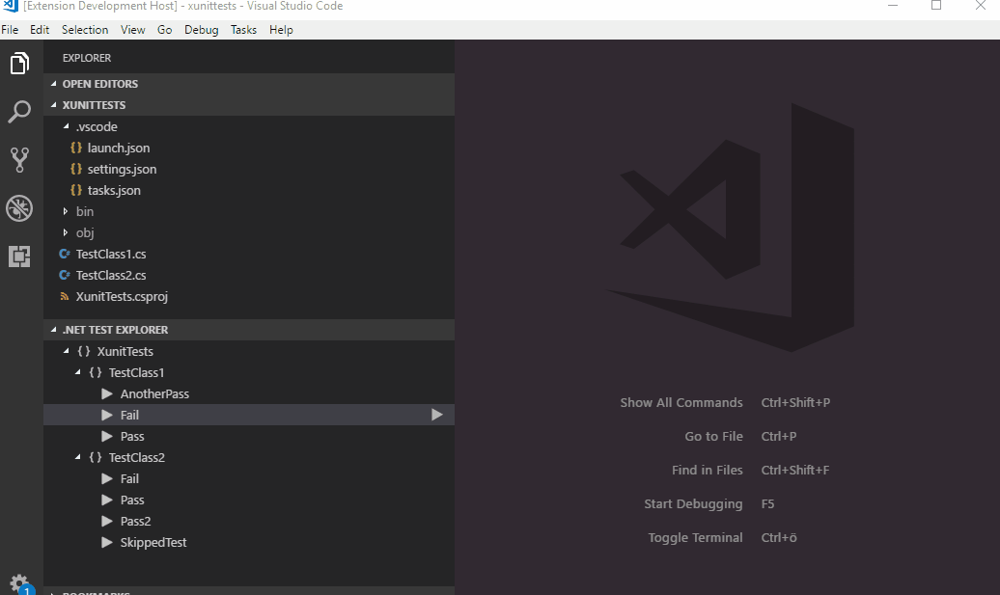
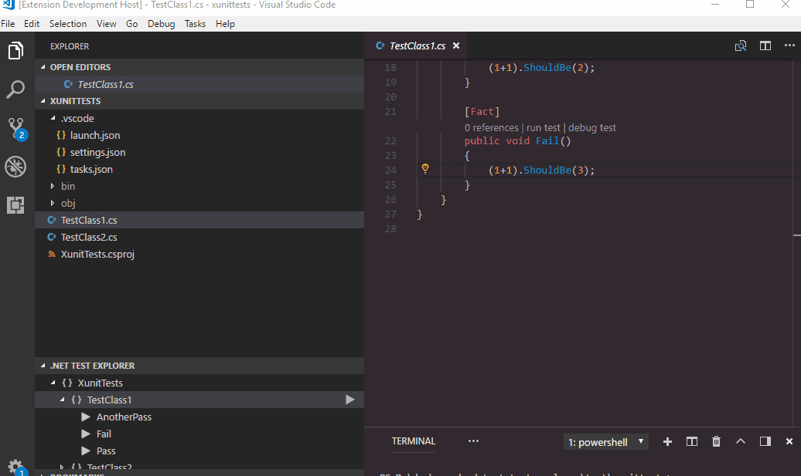

[](https://gitter.im/vscode-dotnet-test-explorer/Lobby)

# .NET Core Test Explorer

## Features

* Test Explorer for .NET Core

## Prerequisites

* [.NET Core](https://www.microsoft.com/net/core) is installed

## Usage

Open a .NET Core test project, or set `dotnet-test-explorer.testProjectPath` to the folder path of .NET Core test project. Then, you will see all the tests in Test Explorer.



After you run tests from Test Explorer, you could see test results in CodeLens for C# test projects (This feature depends on [C# extension](https://marketplace.visualstudio.com/items?itemName=ms-vscode.csharp))



If you are using XUnit the test result of the last run tests are also shown in the tree



Right click on a test node to navigate to the test code



There is also an option to execute test in context of the current cursor. This is available from the right click menu or (probably more usefull) as a keyboard short cut (default alt-r alt-u). 



## Settings

* `dotnet-test-explorer.testProjectPath`: Folder path of .NET Core test project. You could set the full path or the relative path to the workspace root path. (Default is **""**)
* `dotnet-test-explorer.useTreeView`: If false, will list all tests as the full namespace. When set to true a tree will be created based on the namespaces of the tests. (Only xUnit tests will be listed in a tree view) (Default is **true**)
* `dotnet-test-explorer.build`: If true, projects will be built when refreshing the test explorer. (Default is **true**)
* `dotnet-test-explorer.restore`: If true, dotnet restore will run when refreshing the test explorer. (Default is **true**)
* `dotnet-test-explorer.showCodeLens`: Determines whether to show the CodeLens test status or not. (Default is **true**)
* `dotnet-test-explorer.codeLensFailed`: The text to display in the code lens when a test has failed. (Default is **""**)
* `dotnet-test-explorer.codeLensPassed`: The text to display in the code lens when a test has passed. (Default is **""**)
* `dotnet-test-explorer.codeLensSkipped`: The text to display in the code lens when a test has been skipped. (Default is **""**)
* `dotnet-test-explorer.pathForResultFile`: The path to (temporarily) store test result files in. (Default is os temp dir)

## Known issues

##### Test result is not shown in codelens / tree
Try and change the setting dotnet-test-explorer.pathForResultFile to point to a folder you have access right too.

##### No tree view or color coded explorer for nunit / mstest
This is because of the way test discovery is implemented for nunit / mstest. Work is in progress to better support these test frameworks.

##### DisplayName attribute not working for xunit
Same problem as above.

## Telemetry data

By default, anonymous telemetry data collection is turned on to understand user behavior to improve this extension. To disable it, update the settings.json as below:
```json
{
    "dotnet-test-explorer.enableTelemetry": false
}
```

## Change Log

See Change Log [here](CHANGELOG.md)

## Issues

Currently, the extension is in the very initial phase. If you find any bug or have any suggestion/feature request, please submit the [issues](https://github.com/formulahendry/vscode-dotnet-test-explorer/issues) to the GitHub Repo.
