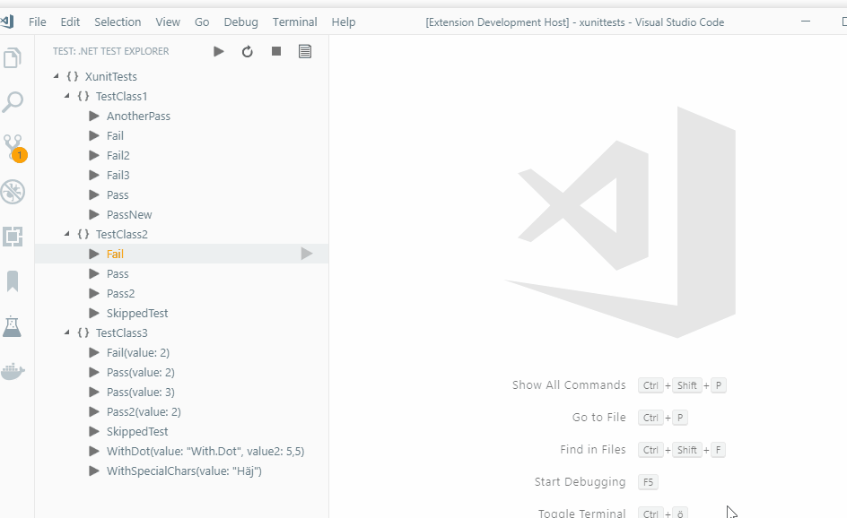
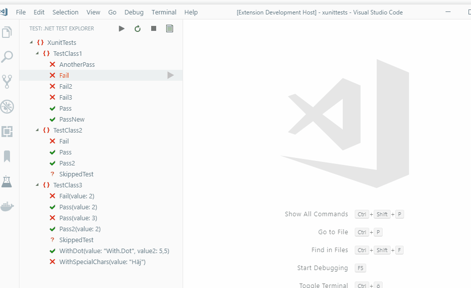
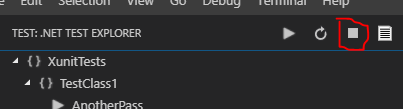
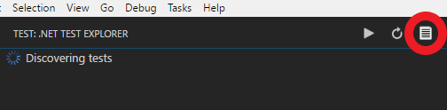

[](https://gitter.im/vscode-dotnet-test-explorer/Lobby)

# .NET Core Test Explorer

## Features

* Test Explorer for .NET Core

## Prerequisites

* [.NET Core](https://www.microsoft.com/net/core) is installed
* NUnit and MSTest requires a dotnet [sdk](https://www.microsoft.com/net/download) version of >= 2.2.104 and running dotnet tooling in English (see [#77](https://github.com/formulahendry/vscode-dotnet-test-explorer/issues/77) for details).

## New in 0.7.3

* Clicking the test status bar now takes you to the test pane
* Various improvements to make discovering your tests easier especially for new users. More details are available [here](https://github.com/formulahendry/vscode-dotnet-test-explorer/pull/268)
* New options for how to display the test tree. In addition to the previous choices of flat representation or a fully expanded representation we have added a third option called "merged" which tries to conserve vertical space where it can. This is now the default behavior.

##### Full


##### Flat


##### Merged


Many thanks to @GeorchW and @hjdarnel for their contributions to this release!

## Usage

Open a .NET Core test project, or set `dotnet-test-explorer.testProjectPath` to the folder path of .NET Core test project. Then, you will see all the tests in Test Explorer.



By utilizing auto watch (see settings) test can be run upon changing in files.



#### Configuring multiple test projects

Setting dotnet-test-explorer.testProjectPath accepts a glob pattern that should point to your test directories. You can also point to files and it will figure out the corresponding path. 

Given the folder structure
* root
  * testProjectOne
    * testproject1.Tests.csproj
  * testProjectTwo
    * testproject2.Tests.csproj

the glob pattern "+(testProjectOne|testProjectTwo)" or "**/*Tests.csproj" should add both of the test projects.

Due to some performance concerns discovery and test running over multiple directories are run one at a time in a synchronous fashion. When running specific tests (eg, not running all tests) the extension should be smart enough to figure out which test directory should be run and only run tests for that directory.

#### Debugging

To debug a test, right click the test and choose to Debug test. The option to run and debug test that appear in the code lens are provided by the omnisharp plugin and has nothing to do with this extension.

The debugger might get stuck before loading your test assembly code. If this happens you can continue the debug process (F5) and it should load the rest of the assemblies and stop and the desired breakpoint.

#### Stopping the current test runner(s)

Press the stop button in the top menu. After killing the process(es) it will perform a new test discovery. This also works as a reset of sorts so if the extension has managed to end up in a weird state where it thinks a test is running even though it is not or that the debugger is running even though it is not the stop button can solve these types of issues as well.



#### Logging

Text from the dotnet test output as well as debug info is written to the Output/Test explorer terminal window. To view the log you can access it simply by clicking the view log icon.




## Keyboard shortcuts

* Run all tests, default Alt+R Alt+A

* Rerun last command, default Alt+R Alt+R

* Run test(s) in context, default Alt+R Alt+C

## Settings

* `dotnet-test-explorer.testProjectPath`: Glob pattern that points to path of .NET Core test project(s). (Default is **""**)
* `dotnet-test-explorer.treeMode`: Determines how the tests should be arranged in the tree. (Default is **"merged"**)
* `dotnet-test-explorer.showCodeLens`: Determines whether to show the CodeLens test status or not. (Default is **true**)
* `dotnet-test-explorer.codeLensFailed`: The text to display in the code lens when a test has failed. (Default is **""**)
* `dotnet-test-explorer.codeLensPassed`: The text to display in the code lens when a test has passed. (Default is **""**)
* `dotnet-test-explorer.codeLensSkipped`: The text to display in the code lens when a test has been skipped. (Default is **""**)
* `dotnet-test-explorer.pathForResultFile`: The path to (temporarily) store test result files in. (Default is OS temp dir)
* `dotnet-test-explorer.autoExpandTree`: If true, the tree will be in an expanded state by default. (Default is **false**)
* `dotnet-test-explorer.addProblems`: If true, failed tests will add to problems view. (Default is **true**)
* `dotnet-test-explorer.autoWatch`: If true, starts dotnet watch test after test discovery is completed. (Default is **false**)
* `dotnet-test-explorer.testArguments`: Additional arguments that are added to the dotnet test command
* `dotnet-test-explorer.leftClickAction`: What happens when a test in the list is left clicked. (Default is **gotoTest**)
* `dotnet-test-explorer.runInParallel`: If true, will discover/build and run test in parallel if you have multiple test projects (Default is **false**)

## Known issues
##### Go to test does not work with multiple workspaces
This is because of limitations in the omnisharp extensions. We can only navigate to symbols which are in the currently selected workspace.

##### Test result is not shown in CodeLens / tree
Try and change the setting dotnet-test-explorer.pathForResultFile to point to a folder you have access right too. CodeLens functionality also requires the [C# extension](https://marketplace.visualstudio.com/items?itemName=ms-vscode.csharp)) 

##### No tree view or color coded explorer for NUnit / MSTest
This requires you to run dotnet SDK version 2.2.104 or higher. The extension tries to run the commands with the English cli but if things are not working as expected anyway it may be due to the cli language (see [#77](https://github.com/formulahendry/vscode-dotnet-test-explorer/issues/77) for details).

##### xUnit projects assembly name needs to match the test class namespace
See [#201](https://github.com/formulahendry/vscode-dotnet-test-explorer/issues/201)

##### DisplayName attribute not working for xUnit
See [#56](https://github.com/formulahendry/vscode-dotnet-test-explorer/issues/56)

##### Project discovery with UNC Paths doesn't work
See [#179](https://github.com/formulahendry/vscode-dotnet-test-explorer/issues/179)

## Telemetry data

By default, anonymous telemetry data collection is turned on to understand user behavior to improve this extension. To disable it, update the settings.json as below:
```json
{
    "dotnet-test-explorer.enableTelemetry": false
}
```

## Change Log

See Change Log [here](CHANGELOG.md)

## Issues

If you find any bug or have any suggestion/feature request, please submit the [issues](https://github.com/formulahendry/vscode-dotnet-test-explorer/issues) to the GitHub Repo.

## ❤️ Contributors

Thanks to all the [contributors](https://github.com/formulahendry/vscode-dotnet-test-explorer/graphs/contributors)!

Special thanks to Stefan Forsberg ([@stefanforsberg](https://github.com/stefanforsberg)) for maintaining the project and implementing so many cool features! Also thanks to Janaka Abeywardhana ([@janaka](https://github.com/janaka)) for maintaining the project!
