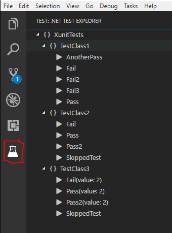
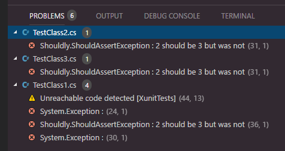
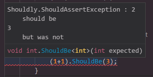
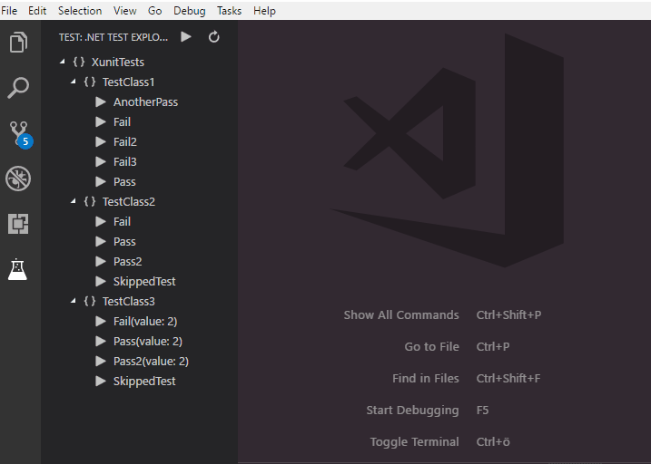

[](https://gitter.im/vscode-dotnet-test-explorer/Lobby)

# .NET Core Test Explorer

## Features

* Test Explorer for .NET Core

## Prerequisites

* [.NET Core](https://www.microsoft.com/net/core) is installed
* NUnit and MsTest requires a dotnet [sdk](https://www.microsoft.com/net/download) version of >= 2.1.2

## New in 0.3.0

Test explorer has moved to the test view panel



Test being run are indicated by a spinner


Failed test adds to the problem terminal view. This can be turned off with a [setting](#settings)





New [keyboard shortcuts](#keyboard-shortcuts) for re-running last test command and running all tests.

## Usage

Open a .NET Core test project, or set `dotnet-test-explorer.testProjectPath` to the folder path of .NET Core test project. Then, you will see all the tests in Test Explorer.



## Keyboard shortcuts

* Run all tests, default Alt+R Alt+A

* Rerun last command, default Alt+R Alt+R

* Run test(s) in context, default Alt+R Alt+C

## Settings

* `dotnet-test-explorer.testProjectPath`: Folder path of .NET Core test project. You could set the full path or the relative path to the workspace root path. (Default is **""**)
* `dotnet-test-explorer.useTreeView`: If false, will list all tests as the full namespace. When set to true a tree will be created based on the namespaces of the tests. (Default is **true**)
* `dotnet-test-explorer.build`: If true, projects will be built when refreshing the test explorer. (Default is **true**)
* `dotnet-test-explorer.restore`: If true, dotnet restore will run when refreshing the test explorer. (Default is **true**)
* `dotnet-test-explorer.showCodeLens`: Determines whether to show the CodeLens test status or not. (Default is **true**)
* `dotnet-test-explorer.codeLensFailed`: The text to display in the code lens when a test has failed. (Default is **""**)
* `dotnet-test-explorer.codeLensPassed`: The text to display in the code lens when a test has passed. (Default is **""**)
* `dotnet-test-explorer.codeLensSkipped`: The text to display in the code lens when a test has been skipped. (Default is **""**)
* `dotnet-test-explorer.pathForResultFile`: The path to (temporarily) store test result files in. (Default is os temp dir)
* `dotnet-test-explorer.autoExpandTree`: If true, the tree will be in an expanded state by default. (Default is **false**)
* `dotnet-test-explorer.addProblems`: If true, failed tests will add to problems view. (Default is **true**)

## Known issues

##### Test result is not shown in codelens / tree
Try and change the setting dotnet-test-explorer.pathForResultFile to point to a folder you have access right too. Code lense functionality also requires the [C# extension](https://marketplace.visualstudio.com/items?itemName=ms-vscode.csharp)) 

##### No tree view or color coded explorer for nunit / mstest
This requieres you to run dotnet sdk version 2.1.2 or higher.

##### DisplayName attribute not working for xunit
See [#56](https://github.com/formulahendry/vscode-dotnet-test-explorer/issues/56)

## Telemetry data

By default, anonymous telemetry data collection is turned on to understand user behavior to improve this extension. To disable it, update the settings.json as below:
```json
{
    "dotnet-test-explorer.enableTelemetry": false
}
```

## Change Log

See Change Log [here](CHANGELOG.md)

## Issues

Currently, the extension is in the very initial phase. If you find any bug or have any suggestion/feature request, please submit the [issues](https://github.com/formulahendry/vscode-dotnet-test-explorer/issues) to the GitHub Repo.
