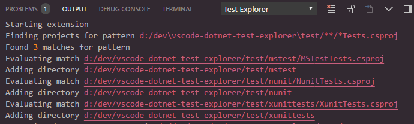

[](https://gitter.im/vscode-dotnet-test-explorer/Lobby)

# .NET Core Test Explorer

## Features

* Test Explorer for .NET Core

## Prerequisites

* [.NET Core](https://www.microsoft.com/net/core) is installed
* NUnit and MsTest requires a dotnet [sdk](https://www.microsoft.com/net/download) version of >= 2.1.2 and running dotnet tooling in english (see [#77](https://github.com/formulahendry/vscode-dotnet-test-explorer/issues/77) for details).

## New in 0.5.0

#### Multiple test projects in a workspace
Support multiple test project in the same workspace. Setting dotnet-test-explorer.testProjectPath now accepts a glob pattern that should point to your test directories. You can also point to files and it will figure out the corresponding path. 

Given the folder structure
* root
  * testProjectOne
    * testproject1.Tests.csproj
  * testProjectTwo
    * testproject2.Tests.csproj

the glob pattern "+(testProjectOne|testProjectTwo)" or "**/*Tests.csproj" should add both of the test projects. The Output/Test explorer terminal should give some info on which directories your pattern is matching.



Due to some performance concerns discovery and test running over multiple directories are run one at a time in a synchronous fashion. When running specific tests (eg, not running all tests) the extension should be smart enought to figure out which test directory should be run and only run tests for that directory.

#### Auto watch
Auto watch only supports one test directory at the current time. If you specify a glob pattern matching multiple test directories only the first one will be watched.

#### Moved test output to Output terminal
Text from the dotnet test output is now written to the Output/Test explorer terminal window instead of using the Terminal window. To view the log you can access it simply by clicking the view log icon.


#### Controlling what happens when left clicking on test
A new setting leftClickAction was added to control what happens when you left click a test. Default is to try and navigate to the test but you can also set it to run a test or do nothing.

## Usage

Open a .NET Core test project, or set `dotnet-test-explorer.testProjectPath` to the folder path of .NET Core test project. Then, you will see all the tests in Test Explorer.


## Keyboard shortcuts

* Run all tests, default Alt+R Alt+A

* Rerun last command, default Alt+R Alt+R

* Run test(s) in context, default Alt+R Alt+C

## Settings

* `dotnet-test-explorer.testProjectPath`: Glob pattern that points to path of .NET Core test project(s). (Default is **""**)
* `dotnet-test-explorer.useTreeView`: If false, will list all tests as the full namespace. When set to true a tree will be created based on the namespaces of the tests. (Default is **true**)
* `dotnet-test-explorer.showCodeLens`: Determines whether to show the CodeLens test status or not. (Default is **true**)
* `dotnet-test-explorer.codeLensFailed`: The text to display in the code lens when a test has failed. (Default is **""**)
* `dotnet-test-explorer.codeLensPassed`: The text to display in the code lens when a test has passed. (Default is **""**)
* `dotnet-test-explorer.codeLensSkipped`: The text to display in the code lens when a test has been skipped. (Default is **""**)
* `dotnet-test-explorer.pathForResultFile`: The path to (temporarily) store test result files in. (Default is os temp dir)
* `dotnet-test-explorer.autoExpandTree`: If true, the tree will be in an expanded state by default. (Default is **false**)
* `dotnet-test-explorer.addProblems`: If true, failed tests will add to problems view. (Default is **true**)
* `dotnet-test-explorer.autoWatch`: If true, starts dotnet watch test after test discovery is completed. (Default is **false**)
* `dotnet-test-explorer.testArguments`: Additional arguments that are added to the dotnet test command
* `dotnet-test-explorer.leftClickAction`: What happens when a test in the list is left clicked. (Default is **gotoTest**)

## Known issues

##### Test result is not shown in codelens / tree
Try and change the setting dotnet-test-explorer.pathForResultFile to point to a folder you have access right too. Code lense functionality also requires the [C# extension](https://marketplace.visualstudio.com/items?itemName=ms-vscode.csharp)) 

##### No tree view or color coded explorer for nunit / mstest
This requieres you to run dotnet sdk version 2.1.2 or higher and running dotnet tooling in english (see [#77](https://github.com/formulahendry/vscode-dotnet-test-explorer/issues/77) for details).

##### DisplayName attribute not working for xunit
See [#56](https://github.com/formulahendry/vscode-dotnet-test-explorer/issues/56)

## Telemetry data

By default, anonymous telemetry data collection is turned on to understand user behavior to improve this extension. To disable it, update the settings.json as below:
```json
{
    "dotnet-test-explorer.enableTelemetry": false
}
```

## Change Log

See Change Log [here](CHANGELOG.md)

## Issues

Currently, the extension is in the very initial phase. If you find any bug or have any suggestion/feature request, please submit the [issues](https://github.com/formulahendry/vscode-dotnet-test-explorer/issues) to the GitHub Repo.
